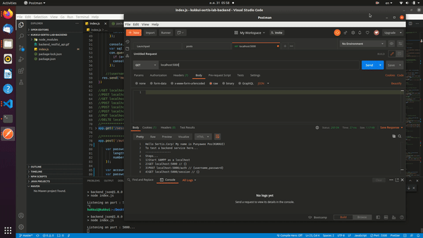
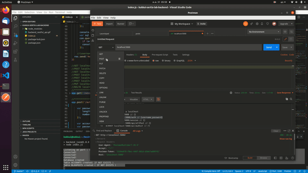
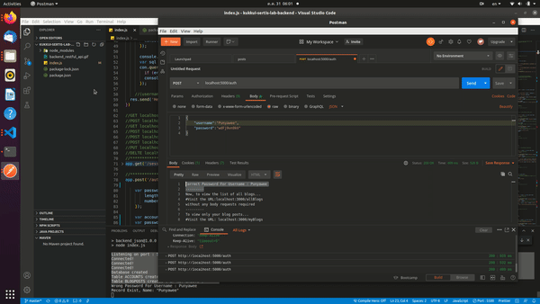
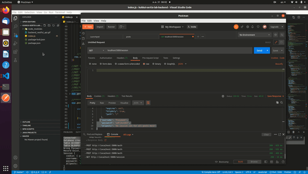
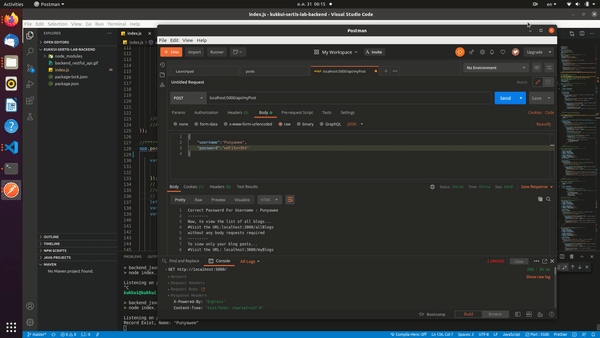
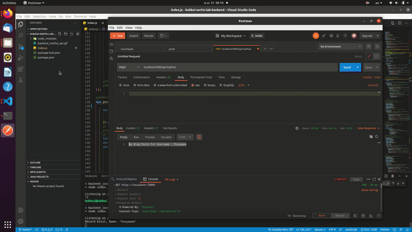
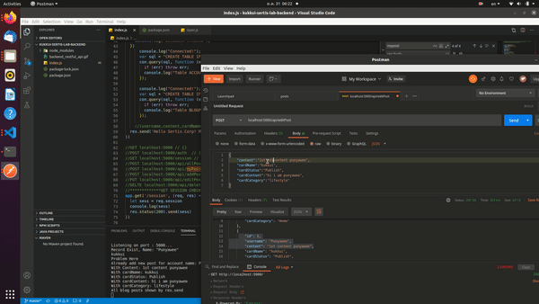
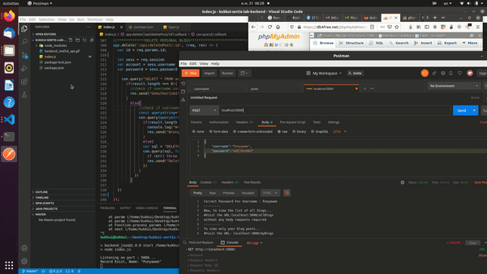

Sertis Backend Lab
<p6>API lists...</p6> 
<p6>
GET localhost:5000 // {} 
POST localhost:5000/auth  // {username,password} 
GET localhost:5000/session // {} 
POST localhost:5000/api/allPost // {} 
POST localhost:5000/api/myPost // {} 
POST localhost:5000/api/addPost // {content,cardName,cardstatus,cardContent,cardCategory} 
PUT localhost:5000/api/editPost/[id] // {content,cardName,cardstatus,cardContent,cardCategory} 
DELTE localhost:5000/api/deletePost/[id] // {} 
</p6>

 

 
 
 
<b>GET localhost:5000 // {} </b>  

 
 
<b>POST localhost:5000/auth  // {username,password} </b>  

 
 
<b>GET localhost:5000/session // {} </b>  

 
 
<b>POST localhost:5000/api/allPost // {} </b>  

 
 
<b>POST localhost:5000/api/myPost // {} </b>  

 
 
<b>POST localhost:5000/api/addPost // {content,cardName,cardstatus,cardContent,cardCategory} </b>  

 
 
<b>PUT localhost:5000/api/editPost/[id] // {content,cardName,cardstatus,cardContent,cardCategory} </b>  

 
 
<b>DELTE localhost:5000/api/deletePost/[id] // {} </b>  

 

  

